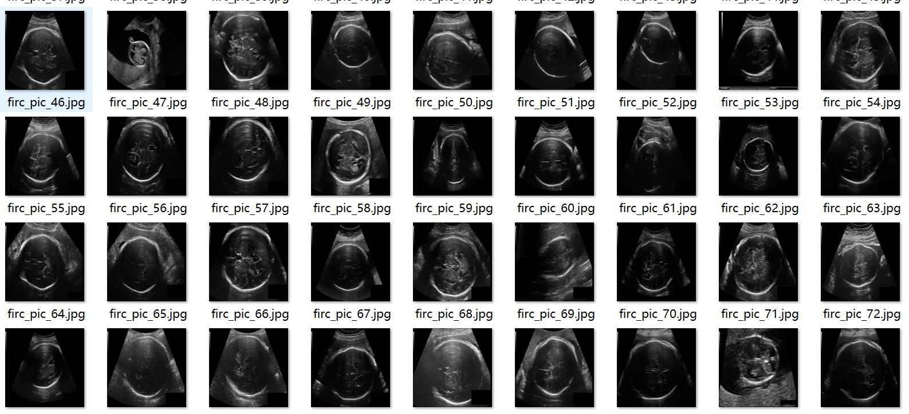
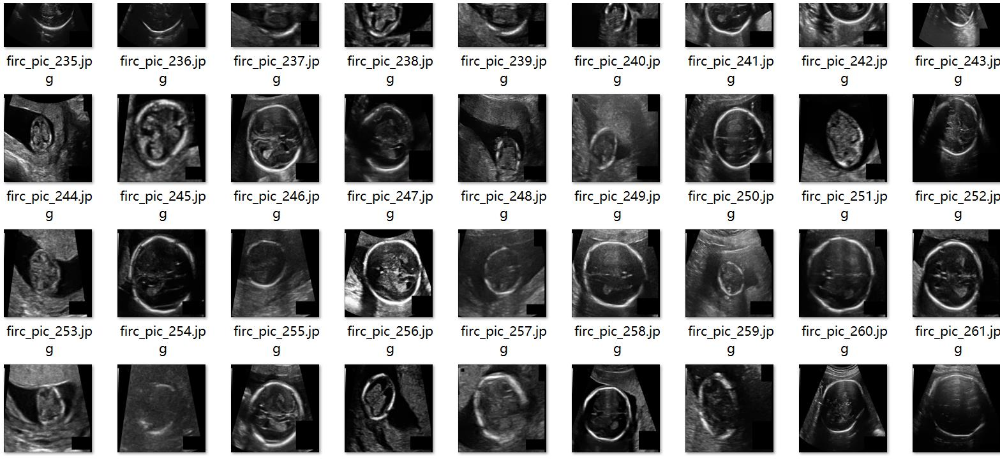
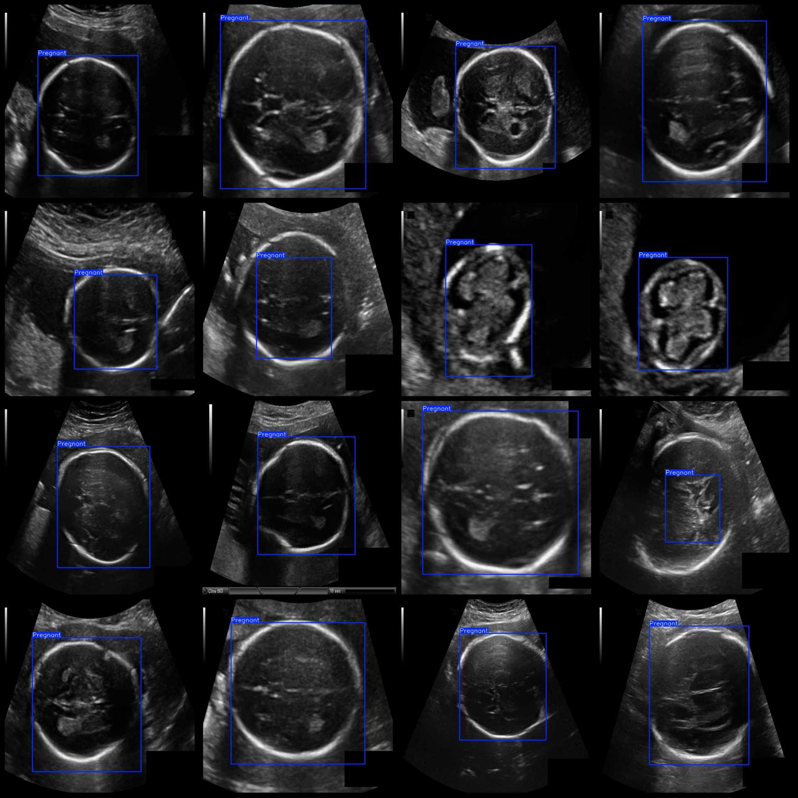
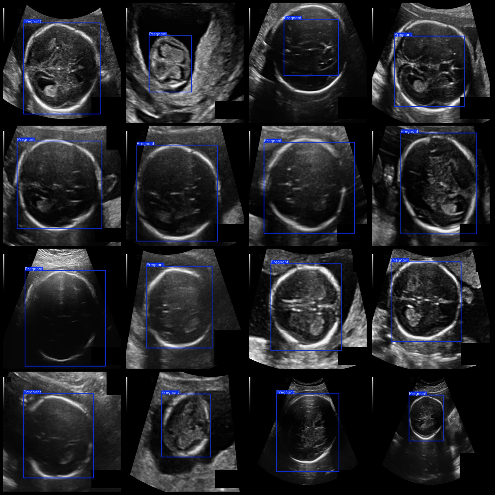

# Pregnancy B-ultrasound Detection Data VOC+YOLO Format, 1114 Images, 1 Classification

dataset format: Pascal VOC format+YOLO format (without split path in txtfile, only containing jpgimage and corresponding VOC format xmlfile and yolo format txtfile)
number of images: 1114  
annotation count: 1114  
annotation count: 1114  
annotationnumber of classes: 1  
annotation class names:["Pregnant"]  
boxes per class:   
Pregnant box count = 1115  
total boxes: 1115  
images per class:   
Pregnant images = 1114  
image resolution: 640x640  
Use annotation tool: labelImg  
Annotation rules: Draw a rectangle around the class for each sample.  
Important notes: The dataset needs to be divided into training, validation, and test sets, which must be done by yourself.  
Special statement: This dataset does not guarantee the accuracy of the trained model or weight file.  
Image preview:
## Images

Here is a pay link on Stripe ( https://buy.stripe.com/3cs8yP7sY87d0vu9AB ). Please contact me lonlonago@foxmail.com after funding $89, and I will send you a complete data files , thank you!

